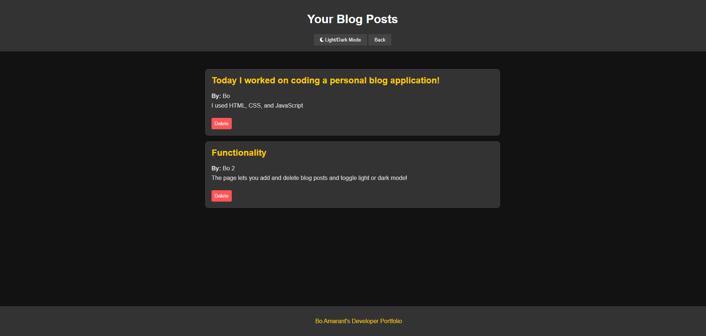

# Personal-Blog-App

## Description

This project was completed for the Columbia Coding Bootcamp. The purpose of this project was to create a personal blog using HTML, CSS, and JavaScript. This project allows you to create new blog posts that save to localStorage for viewing later on.

## Installation

N/A

## Usage

This project is being deployed on GitHub Pages at the following URL: [https://note-taker-application-6lpo.onrender.com/](https://note-taker-application-6lpo.onrender.com/). 

## Credits

I referenced previous projects and examples from the Columbia University Coding Bootcamp to assist in creating this page. 

## Features

The application allows users to enter blog posts with an author name, blog title, and blog content. These will be displayed on another page where the user can toggle light or dark mode or delete their posts. There are also buttons to go to and from the create blog post page and the blog post list page.

## Screenshot of Deployed Application

